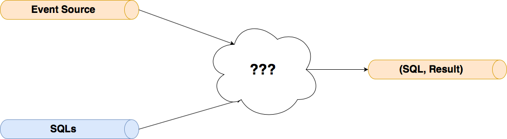
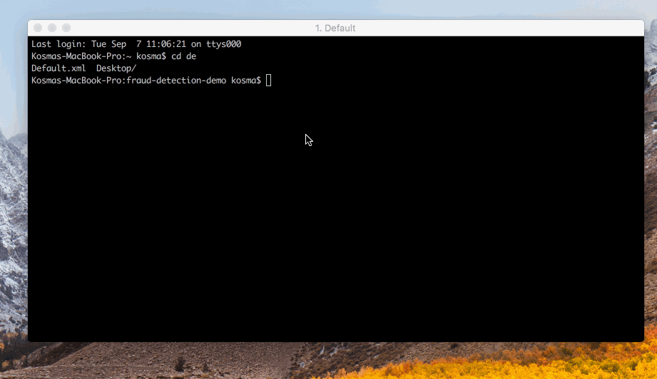
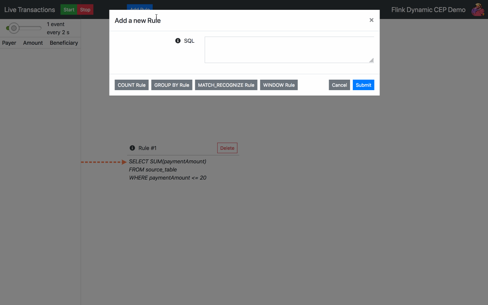
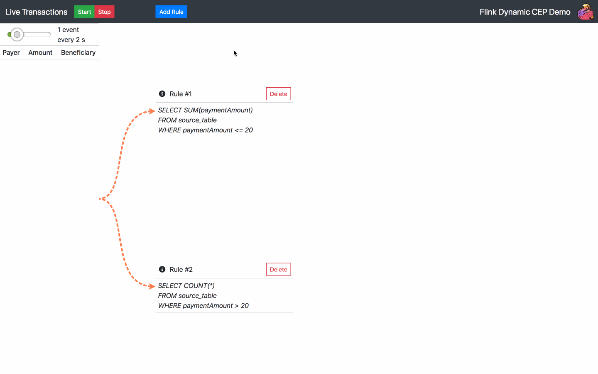
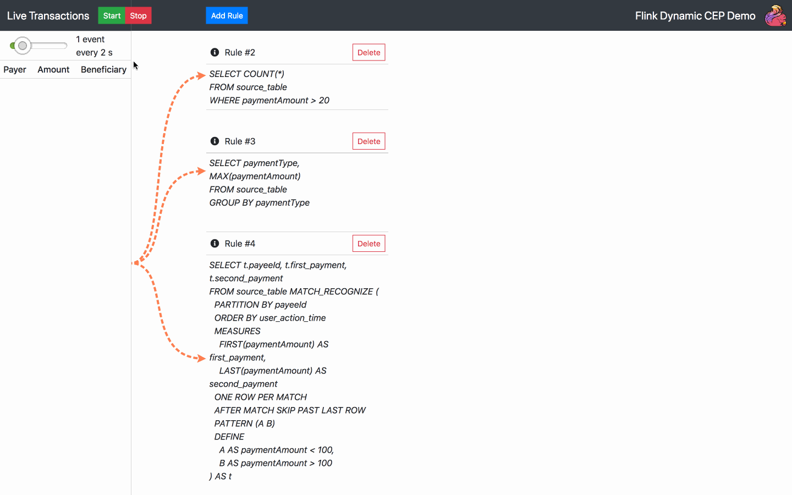
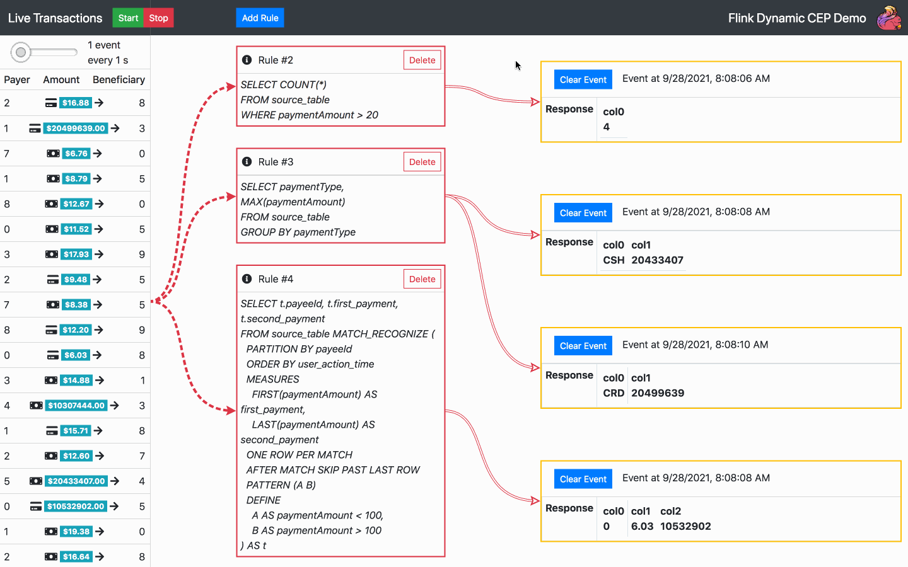
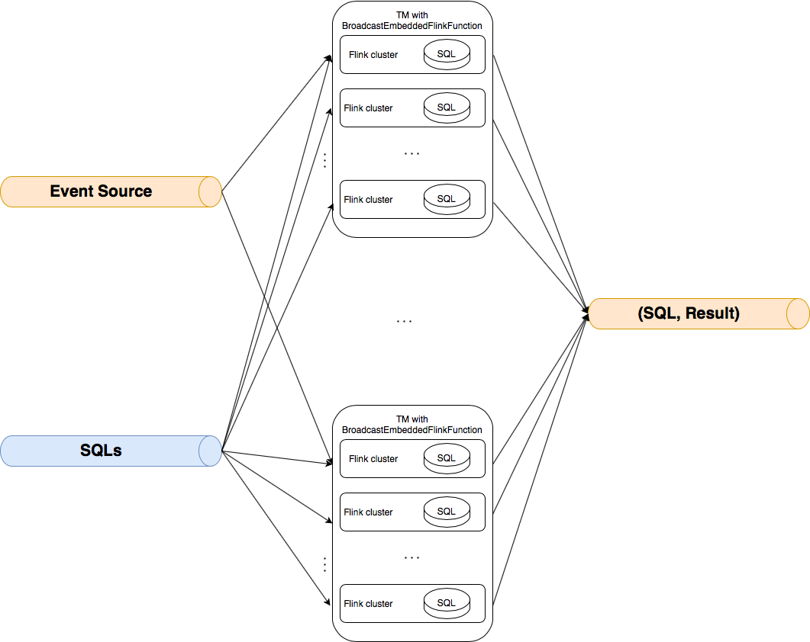
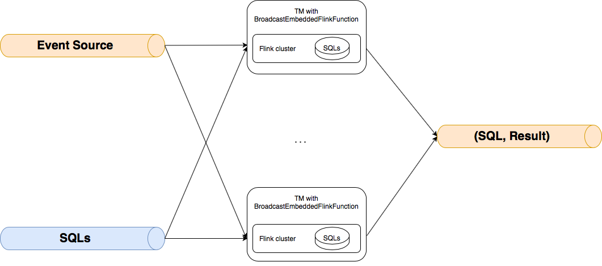

# Dynamic SQL processing with Apache Flink
### Kosma Grochowski

In this blogpost, I want to cover the hidden possibilities of the  current Flink implementation, which allow the construction of a component based on KeyedBroadcastProcessFunction, which can take the event source and the SQL source as an input, and return the result of each sent query. This makes it possible to run multiple Flink SQL queries in a dynamic, user-oriented way.

The dynamic SQL processing demo is provided at <GitHub link>. Its implementation is based on a demo from [this great blog series by Alexander Fedulov](http://flink.apache.org/news/2020/01/15/demo-fraud-detection.html). The following sections will reveal the solution's concept and implementation details, showcase demo features and suggest the possible ways forward.__

## Concept
The basic concept can be illustrated as in below diagram. We want to create an operator, which can take the event source and the SQL source as an input, and return the result of each sent query. This makes it possible to run multiple Flink SQL queries in a dynamic, user-oriented way. The event source is assumed to be pre-keyed. The SQL stream is broadcasted to each of the physical partitions of the input. For each incoming broadcasted event, the SQL query inside it is executed. For each incoming source event, the results of all SQLs processing along with the query itself are returned.

## Demo
In order to access the demo contents, simply clone its repository

	git clone git@gitlab.com:<GitHub link>.git

The detailed instructions on how to run a demo are located in `README.md`. However, in order to run a demo in a default setting, the following commands are enough:

	docker build -t demo-webapp:latest -f webapp/webapp.Dockerfile webapp/
	docker build -t demo-flink-job:latest -f flink-job/Dockerfile flink-job/
	docker-compose -f docker-compose-local-job.yaml up

Once the above steps are taken, head over to the `location:5656` to see the React web application of the demo. 

The demo allows interacting with a stream of randomly generated financial transactions stream with the following schema, [again copied from this blog](http://flink.apache.org/news/2020/01/15/demo-fraud-detection.html):

- transactionId
- eventTime
- payeeId
- beneficiaryId
- paymentAmount
- paymentType
- ingestionTimestamp

By default, there is one SQL rule already running at the start of the application. From now on, the following actions are available:

- Add an SQL rule - choose one of the default rules or write your own

- Delete a rule - choose one of the current rules to delete

- Start, stop or change speed of a transaction stream

- Clear event notifications

## Implementation details
Following is the diagram of the architecture chosen for the operator

This behavior was implemented as an extension to the `KeyedBroadcastProcessFunction` 

	public class BroadcastEmbeddedFlinkFunction<KEY, IN> extends 
	KeyedBroadcastProcessFunction<KEY, IN, SqlEvent, Tuple4<String, Boolean, Row, Long>> {
		...
	  	public BroadcastEmbeddedFlinkFunction(
	      TypeInformation<IN> inTypeInfo,
	      List<String> expressions,
	      Class converterIn,
	      AssignerWithPeriodicWatermarks<IN> assigner)
		...
	}
This operator requires the following information for the constructor:
	
- `inTypeInfo` - type information of event source's event class (`IN`)
- `expressions` - a list of `IN` attributes
- `converterIn` - a class of custom converter, which allows conversion of `IN` to `String` and comma-separated `String` to `IN`
- `assigner` - watermark assigner
 
 

Worth noting is the idea of "Flinkception" - running a Flink mini cluster (available in the form of [MiniClusterWithClientResource](https://ci.apache.org/projects/flink/flink-docs-release-1.11/api/java/org/apache/flink/test/util/MiniClusterWithClientResource.html)) inside the broadcast function. In order to execute the incoming SQL, a new  `MiniClusterWithClientResource` is created for each physical partition.

	 public void processBroadcastElement(
      SqlEvent value, Context ctx, Collector<Tuple4<String, Boolean, Row, Long>> out)
      throws Exception {
      	   ...
	      BroadcastEmbeddedFlinkCluster<IN> cluster =
	          new BroadcastEmbeddedFlinkCluster<IN>(
	              value.sqlQuery, inTypeInfo, expressions, converterIn.getClass(), assigner, startTime);
	
	      cluster.open(generateSourcePort());
	      clusters.put(value.sqlQuery, cluster);
      	   ...
      }

	public class BroadcastEmbeddedFlinkCluster<IN> implements Serializable {
		...
		public void open(int dsSourcePort) throws Exception {
		    miniClusterResource =
		        new MiniClusterWithClientResource(
		            new MiniClusterResourceConfiguration.Builder()
		                .setConfiguration(getConfig())
		                .setNumberTaskManagers(NUM_TMS)
		                .setNumberSlotsPerTaskManager(NUM_SLOTS_PER_TM)
		                .build());
		
		    miniClusterResource.before();
		    ClusterClient<?> clusterClient = miniClusterResource.getClusterClient();
		
		    executor = createDefaultExecutor(clusterClient);
		
		    SessionContext sessionContext = new SessionContext("default", new Environment());
		    sessionId = executor.openSession(sessionContext);
		
		    Runtime.getRuntime().addShutdownHook(new EmbeddedShutdownThread(sessionId, executor));
		
		    StreamExecutionEnvironment keyEnv =
		        (StreamExecutionEnvironment)
		            FieldUtils.readField(executor.getExecutionContext(sessionId), "streamExecEnv", true);
		    tableEnv =
		        (StreamTableEnvironment) executor.getExecutionContext(sessionId).getTableEnvironment();
		
		    String dsSourceHostName = "localhost";
		
		    inputSource =
		        keyEnv.addSource(
		            new CustomSocketTextStreamFunction(
		                dsSourceHostName, dsSourcePort, "\n", 0, customLogger),
		            "My Socket Stream");
		    clientSocket = new Socket(dsSourceHostName, dsSourcePort);
		    customLogger.log("Client socket port" + clientSocket.getLocalPort());
		    writer = new OutputStreamWriter(clientSocket.getOutputStream());
		
		    if (converterIn == null) {
		      BroadcastEmbeddedFlinkCluster.converterIn = (StringConverter) converterInClass.newInstance();
		    }
		    DataStream<IN> inputDS =
		        inputSource
		            .map((MapFunction<String, IN>) s -> (IN) converterIn.toValue(s))
		            .returns(inTypeInfo)
		            .assignTimestampsAndWatermarks(assigner);
		
		    Expression[] defaultExpressions = {$("user_action_time").rowtime()};
		
		    Table inputTable =
		        tableEnv.fromDataStream(
		            inputDS,
		            Stream.concat(
		                    expressions.stream().map(Expressions::$), Arrays.stream(defaultExpressions))
		                .toArray(Expression[]::new));
		
		    tableEnv.createTemporaryView("source_table", inputTable);
		    resultDescriptor = executor.executeQuery(sessionId, sql);
		  }
		  ...
	  }

Communication between the “outer” Flink (where the events are acquired) and the “inner” one (mini cluster that processes the events) is done using a custom implementation of the [SocketTextStreamFunction](https://ci.apache.org/projects/flink/flink-docs-release-1.11/api/java/org/apache/flink/streaming/api/functions/source/SocketTextStreamFunction.html). During the mini cluster initialization, the socket is created, then each incoming event in the “outer” is converted to `String` in order to be written into the socket. The `SocketTextStreamFunction` event source is treated as a table of name `source_table` with columns names being `expressions`. Using the [LocalExecutor](https://ci.apache.org/projects/flink/flink-docs-release-1.11/api/java/org/apache/flink/client/deployment/executors/LocalExecutor.html), after each event ingestion, the results of SQL query are collected by the cluster and returned by the broadcast function.

	 @Override
	  public void processElement(
	      IN value, ReadOnlyContext ctx, Collector<Tuple4<String, Boolean, Row, Long>> out)
	      throws Exception {
	    try {
		 String strValue = converterIn.toString(value);
	
	      for (BroadcastEmbeddedFlinkCluster<IN> cluster : clusters.values()) {
	        cluster.write(strValue);
	      }
	      for (BroadcastEmbeddedFlinkCluster<IN> cluster : clusters.values()) {
	        List<Tuple4<String, Boolean, Row, Long>> output = cluster.retrieveResults();
	        for (Tuple4<String, Boolean, Row, Long> line : output) {
	          out.collect(line);
	        }
	      }
	    } catch (Exception e) {
	      logger.log("processElement exception: " + e.toString());
	      throw e;
	    }
	  }

### Further work
Further work needs to be done concerning the performance and the stability of the solution. Currently, for each incoming SQL rule in each physical partition a `MiniClusterWithClientResource` is created, which creates a large performance overhead. A more performant solution would be to create just one    `MiniClusterWithClientResource` per physical partition. This architecture is shown in the diagram below. However, problems were encountered when testing such an approach. A `LocalExecutor` of the cluster was unable to handle the execution and processing of more than one SQL query - only the first sent query was being executed. More in-depth Flink knowledge would be needed in order to fix this issue. 

Another problem that needs further work is the lost events phenomenon. During the testing of the more complicated SQL features, such as the `MATCH_RECOGNIZE` clause, some expected results were non-deterministic. This problem was hard to resolve in a limited time interval, as it occurred sporadically and was originating in the `LocalExecutor`.

A possible idea for improving both the performance and the robustness of this solution would be to replace a communication by socket in the `MiniClusterWithClientResource` with a Java collection based solution. This would enable easier debugging, as the whole event path could be tracked much easier when dealing with the collection objects as opposed to the socket messaging. Moreover, such an approach would reduce the network load, which potentially could reduce the time and resources needed for the stream processing task.

## Conclusions

The created demo showcases an interesting way of combatting the perennial problem of dynamic SQL execution in Flink. There are still issues to be resolved, but should this be achieved, Flink will be able to perform high-volume real-time businness intelligence in its full extent.

Finally, I'd like to thank Krzysztof Zarzycki and a whole [GetInData](https://getindata.com) team for their invaluable support - none of it would have been possible without their help :)